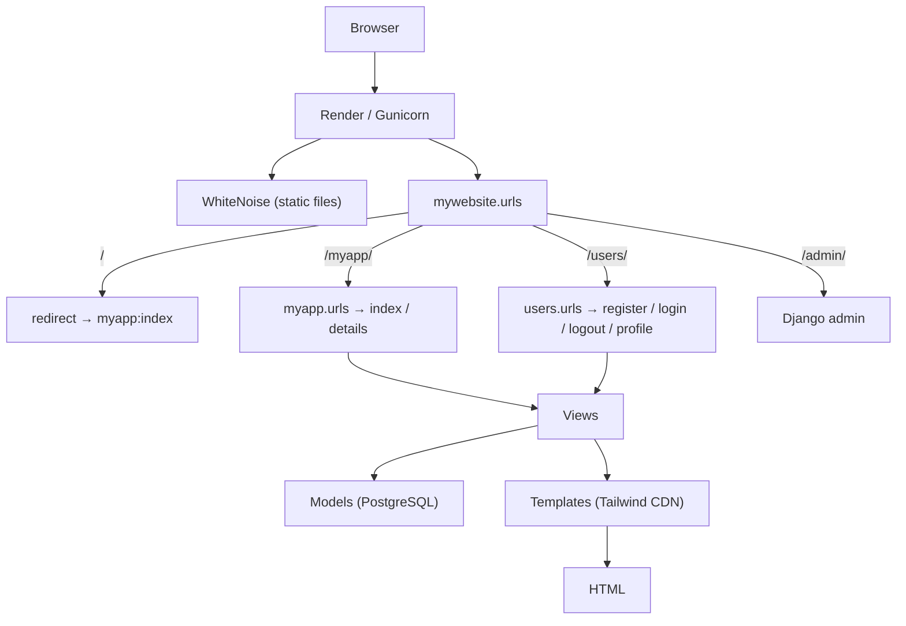

# 🦎 Institute of Alternative Zoology

> A humorous **Django** web application presenting a fictional *"Institute of Alternative Zoology"* —
> a catalogue of absurd, tongue-in-cheek "facts" about animals, with user accounts and a commenting
> system. Its real value is as a demonstration of a **complete, deployable Django stack** (Docker,
> PostgreSQL, Render, environment-based configuration) rather than a toy `runserver` snippet.

<p>
  <a href="https://institute-of-alternative-zoology.onrender.com/myapp/"></a>
  
  
  
  
  
  
</p>

> 🔗 **Live demo:** <https://institute-of-alternative-zoology.onrender.com/myapp/>
>
> ℹ️ **Language note:** the site content (the animal "curiosities", form placeholders, validation
> messages) is in **Polish**; the codebase is in English.

---

## Table of Contents

1. [Purpose](#-purpose)
2. [Main Features](#-main-features)
3. [Tech Stack](#-tech-stack)
4. [Architecture](#-architecture)
5. [Data Model](#-data-model)
6. [Workflow & Deployment](#-workflow--deployment)
7. [Environment Variables](#-environment-variables)
8. [Project Status](#-project-status)

---

## 🎯 Purpose

Alternative Zoology is a **learning project** built to practice the Django framework end-to-end:
models, views (both function- and class-based), templates, forms, authentication, custom password
validators, middleware, and — notably — the full deployment path (Docker, PostgreSQL, Render,
environment-based configuration).

The domain is deliberately silly: it hosts a collection of **"curiosities"** — satirical descriptions
of animals (frogs that can't play guitar, aristocratic penguins, crocodile dentists…), written in
Polish. Each curiosity has a mock *"stupidity scale"* and a picture. Registered users can leave
comments.

Beyond the joke, the project's real value is as a demonstration of a **complete, deployable Django
stack** rather than a toy `runserver` snippet.

---

## ✨ Main Features

| Feature | Description |
|---|---|
| **Curiosity catalogue** | Paginated list (6 per page) of animal "curiosities" with thumbnail, title and truncated content. |
| **Detail pages** | Full curiosity view with image, content and a comment thread. |
| **User accounts** | Registration, login, logout and a profile page with avatar. |
| **Comments** | Authenticated users can post comments (max 500 chars) on any curiosity; comments deep-link with anchors. |
| **Profile avatars** | Per-user profile image via `Pillow` `ImageField`, with a default placeholder. |
| **Localized validation** | Custom Polish-language wrappers around Django's built-in password validators. |
| **Admin panel** | Django admin registered for `Curiosity`, `Comment` and `Profile`. |
| **Seed data** | `animals.json` fixture with ready-made curiosities, auto-loaded in Docker. |
| **Production deployment** | Fully configured for Render (IaC via `render.yaml`) and Docker Compose. |

---

## 🧰 Tech Stack

**Language & Framework**
- Python 3.12
- Django 5.2.6 (MVT architecture)

**Data & Media**
- PostgreSQL 15 (via `psycopg[binary]` 3.2.10)
- `dj-database-url` for `DATABASE_URL` parsing
- Pillow 11.3 (image handling)

**Frontend**
- Django Templates
- Tailwind CSS — loaded via the **browser CDN build** (`@tailwindcss/browser@4`), no local build pipeline

**Server & Static**
- Gunicorn (WSGI server)
- WhiteNoise 6.11 (static file serving with `CompressedManifestStaticFilesStorage`)

**Config & Ops**
- `python-dotenv` (`.env` loading)
- Docker + Docker Compose
- Render (`render.yaml` infrastructure-as-code)

**Logging**
- Standard library `logging`, configured to console + `debug.log` file.

---

## 🏛 Architecture

Standard Django **Model–View–Template (MVT)** layout, split into two apps under one project.



Project layout:

```
mywebsite/            → Django project (settings, root urls, wsgi/asgi)
│
├── myapp/            → Domain app: curiosities & comments
│   ├── models.py     → Curiosity, Comment
│   ├── views.py      → index (list+paginate), details (view+comment)
│   ├── forms.py      → CommentForm, CuriosityForm*
│   ├── middleware.py → Log / Timer / IpResolver middleware (defined, not wired in)
│   ├── fixtures/     → animals.json seed data
│   └── templates/    → base, index, details (+ unused CRUD templates)
│
├── users/            → Auth app
│   ├── models.py     → Profile (OneToOne with User, avatar)
│   ├── views.py      → register, logout_view, profile
│   ├── forms.py      → RegisterForm, LoginForm (Polish placeholders)
│   ├── validators.py → PL* password validators
│   └── templates/    → login, logout, register, profile
│
├── docker/entrypoint.sh  → wait-for-db → migrate → collectstatic → loaddata → gunicorn
├── docker-compose.yml    → web + postgres:15
├── dockerfile            → python:3.12-slim image
├── render.yaml           → Render web service + managed Postgres
└── requirements.txt
```

---

## 🗃 Data Model

```mermaid
erDiagram
    USER ||--o{ CURIOSITY : "authors (optional)"
    USER ||--o{ COMMENT : writes
    USER ||--|| PROFILE : has
    CURIOSITY ||--o{ COMMENT : receives
    CURIOSITY {
        string topic
        text content
        int stupidity_scale "0–100"
        string picture "image URL"
        FK user_name "→ User (optional)"
    }
    COMMENT {
        text content "max 500 chars"
        datetime created_on "ordered ascending"
        FK curiosity
        FK user
    }
    PROFILE {
        OneToOne user
        image image "avatar"
    }
```

- **Curiosity** — `topic`, `content`, `stupidity_scale` (0–100), optional `user_name` (FK → User), `picture` URL.
- **Comment** — FK → Curiosity, FK → User, `content`, `created_on` (ordered ascending).
- **Profile** — OneToOne → User, `image` avatar.

---

## 🔄 Workflow & Deployment

### Local run (Docker — recommended)
```bash
# 1. Create your env file (see note below)
cp .env.example .env    # ⚠ .env.example is referenced but NOT shipped — create .env manually

# 2. Build & start (Postgres + web)
docker compose up --build
```
The entrypoint waits for Postgres, runs migrations, collects static files, loads the `animals.json`
fixture, then starts Gunicorn.

App is served at **http://localhost:8010**.

### Local run (bare metal)
```bash
python -m venv .venv && source .venv/bin/activate   # (Windows: .venv\Scripts\activate)
pip install -r requirements.txt
# set env vars / .env, ensure Postgres is reachable
python manage.py migrate
python manage.py loaddata animals.json
python manage.py runserver
```

### Production (Render)
`render.yaml` provisions a Python web service + managed Postgres in Frankfurt:
- **build:** `pip install` → `collectstatic`
- **pre-deploy:** `migrate`
- **start:** `gunicorn mywebsite.wsgi:application`

Secrets (`DJANGO_SECRET_KEY`) are generated by Render; `DATABASE_URL` is injected from the managed
database.

---

## ⚙️ Environment Variables

The app is configured entirely through environment variables (loaded from `.env` via
`python-dotenv`):

| Variable | Purpose |
|---|---|
| `DJANGO_SECRET_KEY` / `SECRET_KEY` | Django secret |
| `DEBUG` | `"True"`/`"False"` |
| `ALLOWED_HOSTS`, `CSRF_TRUSTED_ORIGINS` | Comma-separated host lists |
| `DATABASE_URL` | Full DB URL (takes priority) |
| `DB_NAME`, `DB_USER`, `DB_PASSWORD`, `DB_HOST`, `DB_PORT` | Discrete DB settings (fallback) |
| `SECURE_SSL_REDIRECT` | Force HTTPS |

> The repo references `.env.example`, but no such file is committed. Use the following as a starting
> point:

```dotenv
DJANGO_SECRET_KEY=change-me
DEBUG=True
ALLOWED_HOSTS=localhost,127.0.0.1
CSRF_TRUSTED_ORIGINS=http://localhost:8010
DB_NAME=zoology
DB_USER=zoology
DB_PASSWORD=zoology
DB_HOST=db
DB_PORT=5432
```

---

## 🚧 Project Status

Functional and deployed, but clearly a **work-in-progress learning project**: it contains unfinished
CRUD scaffolding, defined-but-unused middleware, a broken form class, and **no automated tests**.
